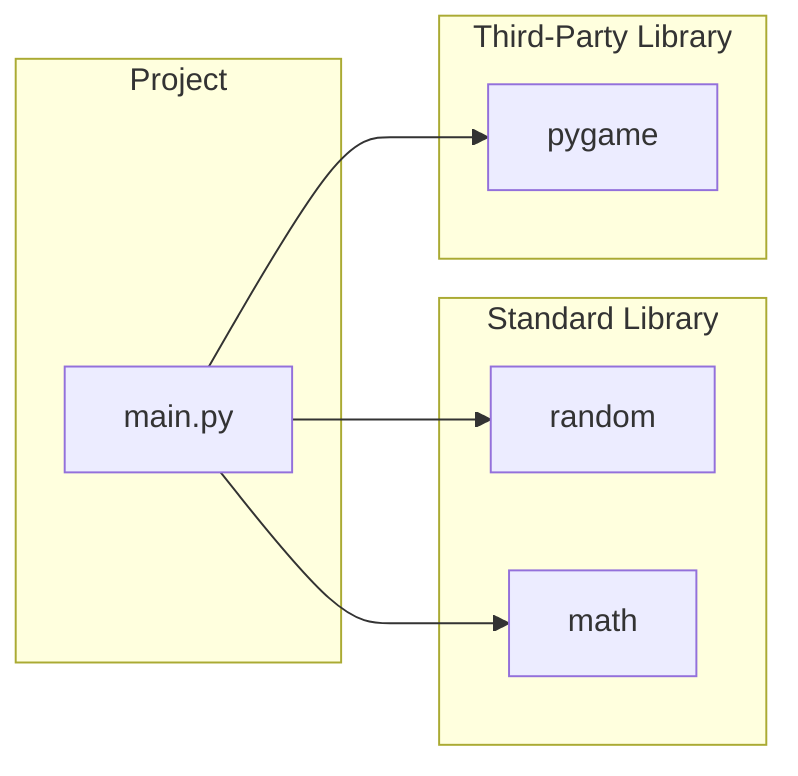
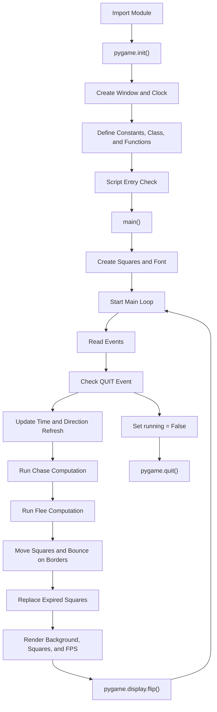
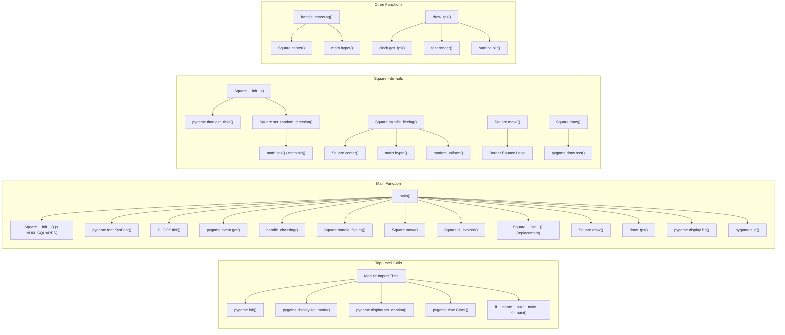
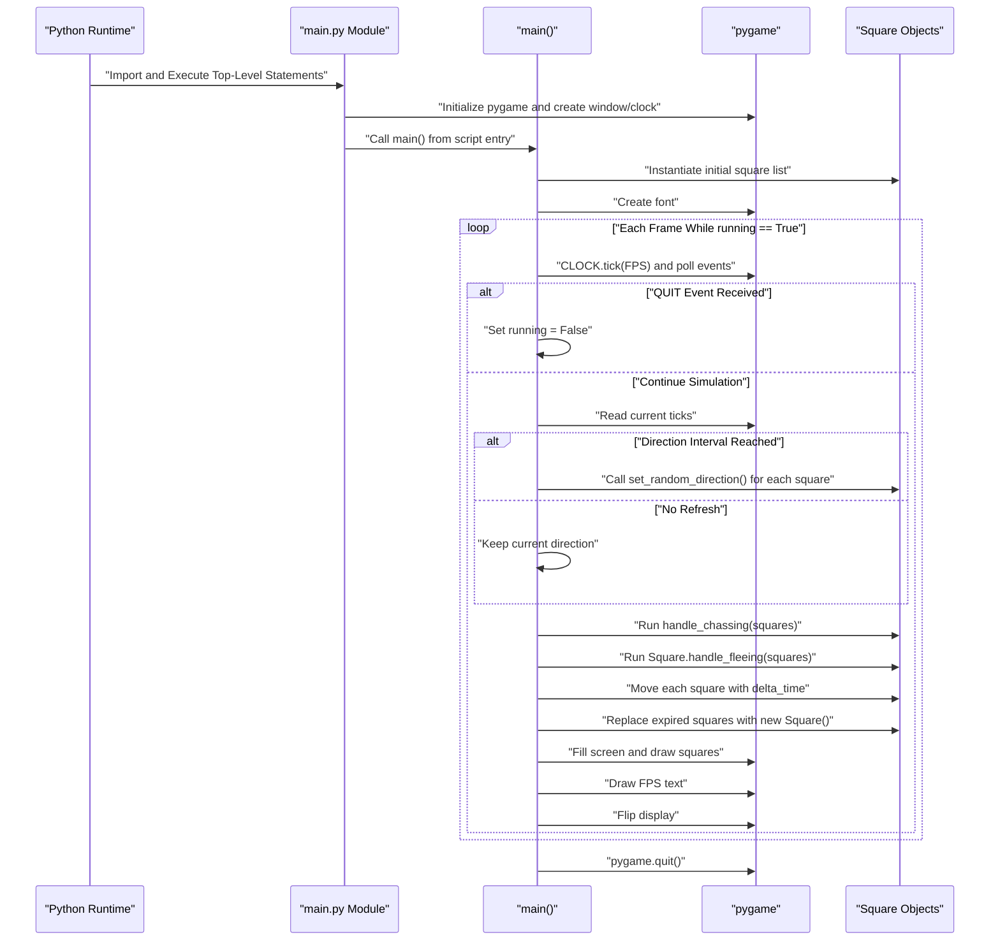

# Architecture Documentation

This document describes the observed architecture of the current `lab8-pygame` codebase based on `main.py`.

## 1) Module Dependency Graph

Notes:
- The project runtime is implemented in a single module: `main.py`.
- `random` and `math` support movement and steering calculations.
- `pygame` provides windowing, timing, drawing, events, and font rendering.

## 2) High-Level Runtime Flow

Notes:
- The game loop is frame-based and throttled to target FPS.
- Direction refresh and lifespan replacement happen inside the loop.

## 3) Function-Level Call Graph

Notes:
- `handle_chassing()` currently computes chase vectors but does not write updated velocity values back to squares.
- Fleeing logic does directly update `square.vx` and `square.vy`.

## 4) Primary Execution Sequence

## Assumptions and Observations

- The architecture is documented from `main.py` as the single executable source.
- The README mentions 10 squares, while code currently uses `NUM_SQUARES = 20`.
- No additional modules were inferred beyond what is explicitly imported or called.
